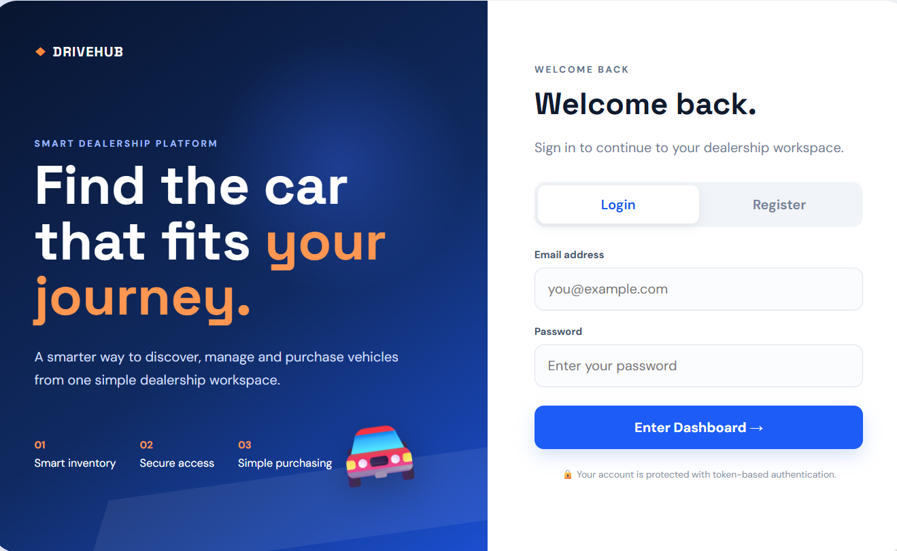
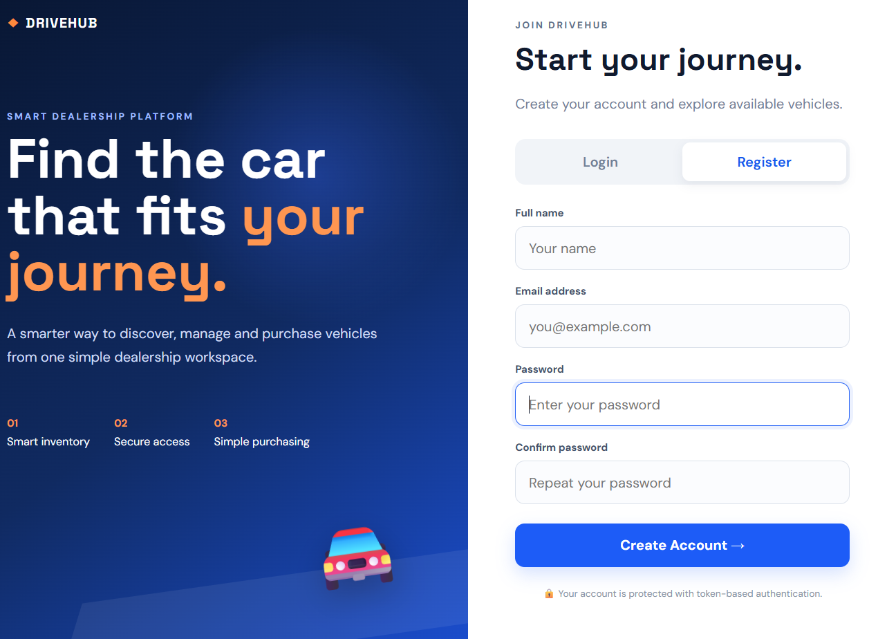
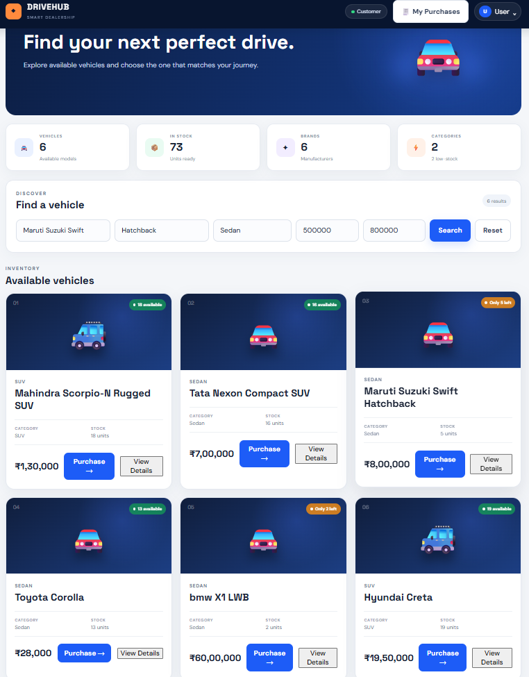
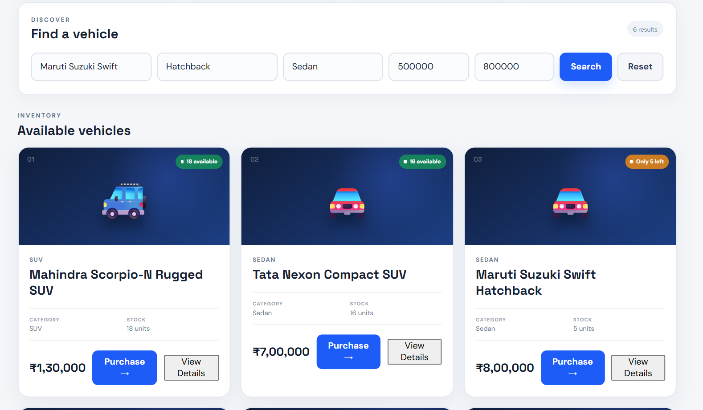
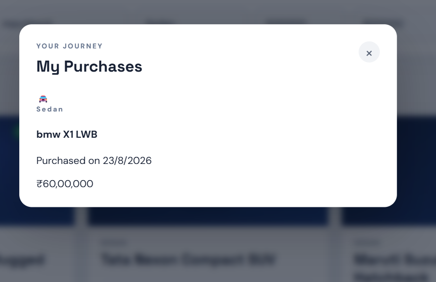
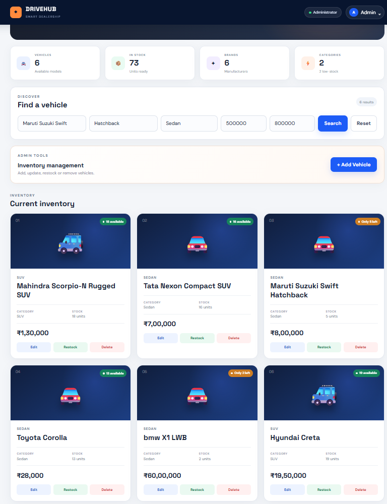

# Car Dealership Inventory System

A full-stack Car Dealership Inventory System developed as a TDD Kata. The application provides vehicle inventory management, user authentication, vehicle search, purchasing, restocking, and purchase history.

## Technologies Used

### Frontend

- React
- HTML5
- CSS3
- Tailwind CSS
- Vite

### Backend

- Node.js
- Express.js
- JWT authentication
- bcryptjs
- Jest
- Supertest

### Database

- MySQL
- mysql2

## Features

### Authentication

- User registration
- User login
- JWT-based authentication
- Protected API endpoints
- Admin authorization

### Vehicle Inventory

- Add a vehicle
- View available vehicles
- Search vehicles by make, model, category, and price
- Update vehicle details
- Delete vehicles
- Admin-only inventory operations

### Purchase and Inventory Management

- Purchase vehicles
- Automatically decrease stock after purchase
- Prevent purchases when stock is unavailable
- Admin vehicle restocking
- Purchase history
- Protected purchase-history access

### Frontend

- User-friendly single-page React application
- Vehicle listing
- Vehicle search and filtering
- Purchase functionality
- Admin inventory functionality
- Responsive interface
- Tailwind CSS styling

## API Endpoints

### Authentication

```text
POST /api/auth/register
POST /api/auth/login
```

### Vehicles

```text
POST   /api/vehicles
GET    /api/vehicles
GET    /api/vehicles/search
PUT    /api/vehicles/:id
DELETE /api/vehicles/:id
```

### Inventory

```text
POST /api/vehicles/:id/purchase
POST /api/vehicles/:id/restock
```

## Project Structure

```text
car-dealership/
├── backend/
│   ├── src/
│   ├── tests/
│   ├── server.js
│   └── package.json
│
├── frontend/
│   ├── src/
│   ├── public/
│   ├── package.json
│   └── vite.config.js
│
├── README.md
├── PROMPTS.md
└── TEST_REPORT.md
```

## Database Setup

The application uses MySQL as its persistent database.

Configure the backend `.env` file with your database details:

```env
DB_HOST=localhost
DB_USER=root
DB_PASSWORD=your_password
DB_NAME=car_dealership_db
JWT_SECRET=your_secret_key
```

**Do not commit real passwords, secrets, or tokens to GitHub.**

## Backend Setup

Open a terminal in the project root and run:

```powershell
cd backend
npm install
node server.js
```

The backend server will start on the configured port.

## Frontend Setup

Open another terminal from the project root:

```powershell
cd frontend
npm install
npm run dev
```

Open the local Vite development URL shown in the terminal.

## Running Tests

The backend tests use Jest and Supertest.

From the project root:

```powershell
cd backend
npm test
```

Final test result:

```text
Test Suites: 2 passed, 2 total
Tests:       85 passed, 85 total
Snapshots:   0 total
```

See `TEST_REPORT.md` for the detailed test report.

## Test Coverage Areas

The test suite covers:

- User registration and login
- Authentication
- JWT-based authorization
- Vehicle creation
- Vehicle listing
- Vehicle search
- Vehicle filtering
- Vehicle updates
- Vehicle deletion
- Admin authorization
- Vehicle purchasing
- Stock quantity reduction after purchase
- Out-of-stock purchase handling
- Vehicle restocking
- Purchase history
- Unauthorized purchase-history access

## Test-Driven Development

The project follows a test-driven development approach. The Git history contains separate test and feature commits documenting the development process.

Examples include:

```text
test: add purchase history API tests
test: finalize authentication test coverage
test: cover whitespace input edge cases
feat: add vehicle details and purchase history
feat: complete vehicle inventory APIs
```

## My AI Usage

I used ChatGPT as an AI development assistant during this project.

### How I Used AI

I used ChatGPT to:

- Understand the project requirements.
- Plan backend API functionality.
- Understand database table requirements.
- Debug backend and database issues.
- Understand and improve automated tests.
- Troubleshoot Git and GitHub commands.
- Understand frontend implementation steps.
- Prepare project documentation.

I reviewed the suggestions, implemented the required changes, and verified the application using automated tests.

### Reflection on AI Usage

AI helped me understand errors more quickly and provided guidance during implementation and debugging. It was especially useful for understanding unfamiliar errors, troubleshooting issues, and organizing project documentation.

I remained responsible for reviewing the suggestions, testing the application, and making the final implementation decisions.

## Screenshots

## Screenshots

### Login



### Registration



### Customer Dashboard



### Vehicle Inventory and Search



### Purchase History



### Admin Inventory Management



## Deliverables

- Full-stack source code
- Backend REST API
- React frontend
- MySQL database integration
- Automated Jest and Supertest tests
- Test report
- AI usage documentation
- `PROMPTS.md` containing raw AI prompt/chat documentation
- Public GitHub repository

## Author

Kavya Varikollu